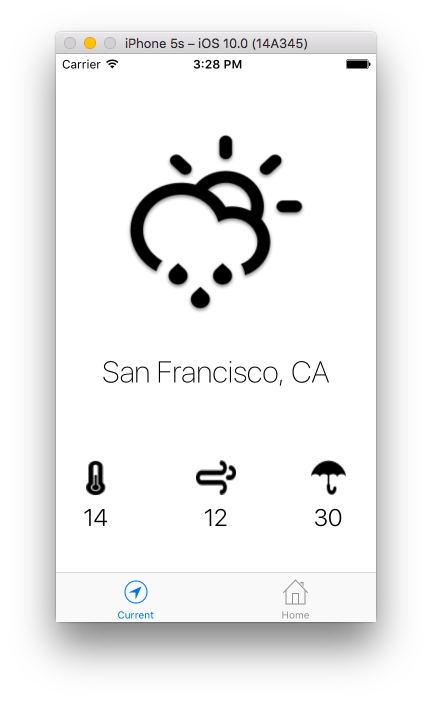

> Yet another simple weather app.

## Motivation

This application was made during iOS-course in VK.com University.

## TODO

- [x] Add https://openweathermap.org/ API
- [x] Add pull-to-refresh
- [x] Add LocationManager
- [ ] Implement basic functionality
- [ ] Improve design
- [ ] Make an app icon
- [ ] Add weekly forecast

## License

MIT © [Alexander Nelzin](https://asnelzin.com)
