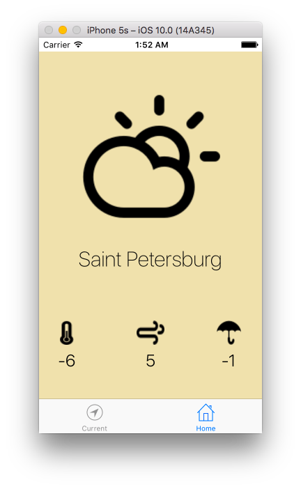

> Yet another simple weather app.

## Motivation

This application was made during iOS-course in VK.com University.

## TODO

- [x] Add https://openweathermap.org/ API
- [x] Add pull-to-refresh
- [x] Add LocationManager
- [x] Implement basic functionality
- [x] Improve design
- [ ] Maybe recreate icons
- [ ] Think about home screen
- [ ] Refactor JSON parsing
- [ ] Make an app icon
- [ ] Add weekly forecast

## License

MIT © [Alexander Nelzin](http://asnelzin.ru)
